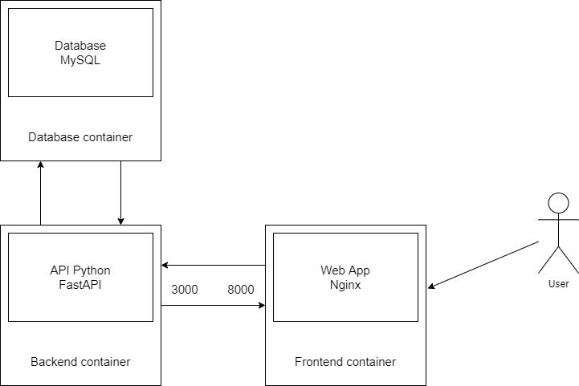

# H3 Hitema - Projet Technique 2021/22

Développement et déploiement d'une application dans le cadre du projet technique Architecture/Docker

## About

Ce projet a été réalisé grace à FastAPI. Le CSS de l'application web a été fourni par Boostrap.

Il a pour objectif d'aider les joueurs de Wakfu dans la progression des niveaux de leur métiers.
Il contient un calculateur pour afficher l'expérience nécessaire pour une plage de niveaux donnée.
Il contient une page permettant d'afficher les recettes de fabrication des objets, ainsi que l'expérience acquise à la fabrication.

## Architecture

## docker-compose up

## Mes images sur Docker Hub
https://hub.docker.com/u/elisadesmetz
